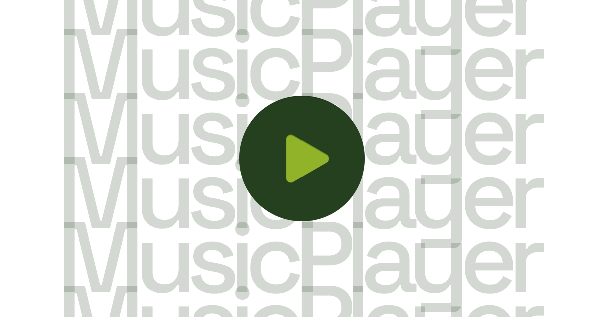
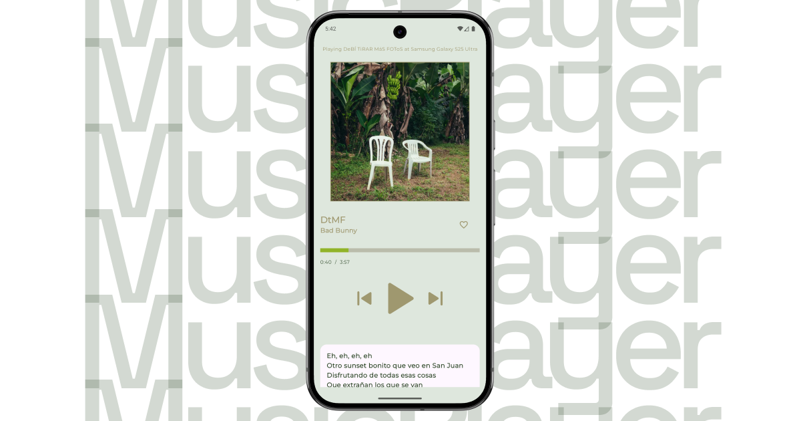
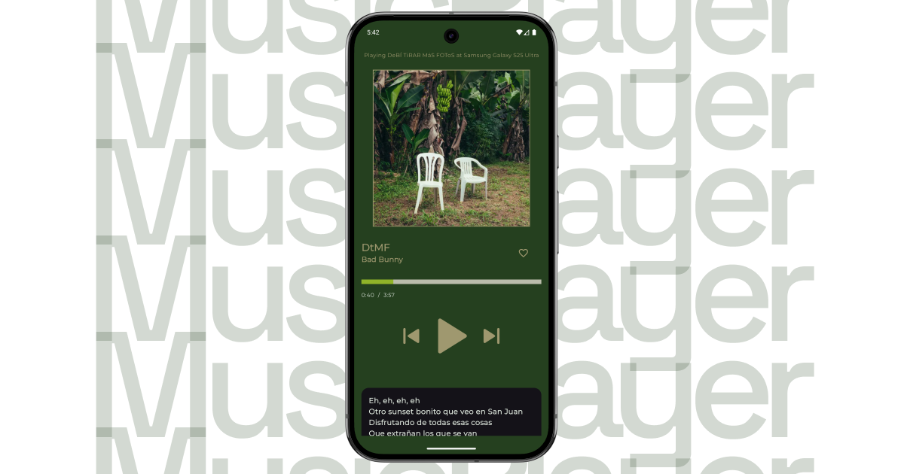

# DtMFMusicPlayer



DtMFMusicPlayer is an Android UI demonstration app.


:rocket: Part of __*[Melodia](https://erad.dev/melodia.html)*__ by __*[erad.dev](https://erad.dev/)*__

## :eyes: Features

- Modern Material 3 UI components
- Dynamic theme support (Light/Dark)

## :hammer: Tech Stack

- Kotlin
- Jetpack Compose
- Material 3

## :running: Installation

1. Clone the repository
```
git clone https://github.com/erad-dev-mx/DtMFMusicPlayer.git
```
2. Open the project in Android Studio
3. Sync dependencies and run the app on an emulator or device

## :camera: Screenshots



## :sunglasses: Contributing

Contributions are welcome! Feel free to fork the project and submit a pull request.

## :scroll: License
This project is under the MIT license.

with :heart: erick

